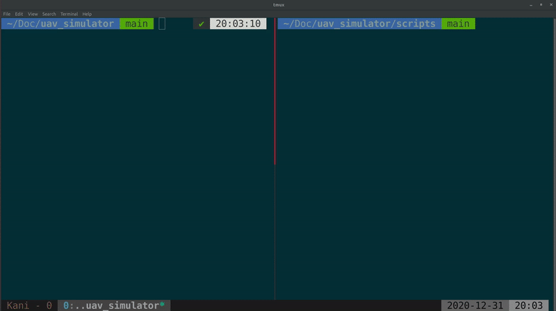

[](https://app.travis-ci.com/fdcl-gwu/uav_simulator)

# Python - Gazebo Simulation Environment for a UAV with Geometric Control

This repository include Python codes for the position control a UAV in a Gazebo simulation environment, using [geometric controllers](https://github.com/fdcl-gwu/uav_geometric_control).

## Features
* Developed using Python
* Uses a geometric controller that works great with aggressive maneuvers
* Uses Gazebo as the physics engine
* Uses only minimal Gazebo/ROS codes so that if something breaks on ROS end in the future, it is easier to fix
* Has a nice GUI for controlling the UAV
* Can run your experiments, log data, and plot at the end of the trajectory at a click of a button
* Estimator, controller, and trajectory generators are in their own Python classes, if you need to test your own estimator, controller, or a trajectory, you only need to modify the respective class


### Why Python?
* Python makes developing/debugging easier and shorter (no compiling)
* Can easily find modules or libraries for different tasks

## Which controller is used for the UAV control?
* A geometric controller with decouppled-yaw attitude control is used
* The controller is published in:
    ```sh
    @InProceedings{Gamagedara2019b,
        title={Geometric controls of a quadrotor uav with decoupled yaw control},
        author={Gamagedara, Kanishke and Bisheban, Mahdis and Kaufman, Evan and Lee, Taeyoung},
        booktitle={2019 American Control Conference (ACC)},
        pages={3285--3290},
        year={2019},
        organization={IEEE}
    }
    ```
* Implementation of the same controller in C++ and Matlab can be found at [https://github.com/fdcl-gwu/uav_geometric_control](https://github.com/fdcl-gwu/uav_geometric_control)

### How to test my own controller?
* Make sure the desired trajectory generates the desired states required by your controller.
* Simply update the `Controller` class with your controller.
* Make sure your modified controller class outputs the variable force-moment vector (`fM`).

## Which estimator is used for the state estimation?
* The estimator defined in the following paper is implemented here (except the sensor bias estimation terms):
    ```sh
    @InProceedings{Gamagedara2019a,
        author    = {Kanishke Gamagedara and Taeyoung Lee and Murray R. Snyder},
        title     = {Real-time Kinematics {GPS} Based Telemetry System for Airborne Measurements of Ship Air Wake},
        booktitle = {{AIAA} Scitech 2019 Forum},
        year      = {2019},
        month     = {jan},
        publisher = {American Institute of Aeronautics and Astronautics},
        doi       = {10.2514/6.2019-2377}
    }
    ```
* Matlab implementation of the above controller can be found at [https://github.com/fdcl-gwu/dkf-comparison](https://github.com/fdcl-gwu/dkf-comparison).
* Note that the Matlab implementation has a delayed Kalman filter that has not been implemented here. Only the non-delayed parts inside `DelayedKalmanFilter.m` is utilized here.

### How to test my own estimator?
* Make sure your estimator provides the states for the UAV control, or if not create a separate estimator using the current estimator as the base class.
* Update the `Estimator` class with your estimator.

### How to test my own trajectory?
* Add your trajectory generation function in `Trajectory` class.
* Replace that with an unused mode in the `calculate_desired` function inside the `Trajectory` class.

## Setting-up
### Dependencies
1. [ROS](http://wiki.ros.org/): this repository has been developed using ROS Melodic, on Ubuntu 18.04.
1. Python GTK libraries for GUI (not required if you opt to not to use the GUI)
    ```sh
    sudo apt-get install python-gtk2-dev
    ```
1. Python modules: these libraries must be installed in the system
    1. NumPy
    1. Pandas
    1. Matplotlib

### Setting-up the repository
1. Clone the repositroy.
    ```sh
    git clone https://github.com/fdcl-gwu/uav_simulator.git
    ```
1. Update the submodules.
    ```sh
    cd uav_simulator
    git submodule update --init --recursive
    ```

### Setting-up the plugins and Gazebo
You only need to do the followings once (unless you change the Gazebo plugins)
1. Make the pluging.
    ```sh
    cd uav_simulator
    catkin_make
    ```
1. Source the relevant directories (**NOTE**: you need to do this on every new terminal).
    ```sh
    cd uav_simulator
    cd devel && source setup.bash && cd ../
    ```

### Runing the simulation environment 
1. In the current terminal window, launch the Gazebo environment:
    ```sh
    roslaunch uav_gazebo simple_world.launch 
    ```
1. Once the Gazebo is launched, run the rover code from a different rover terminal (if you already don't know, you may find [**tmux**](https://github.com/tmux/tmux/wiki) a life-saver):
    ```sh
    python3 main.py
    ```
    If you change the Python code, simply re-run the Python code



### Tips
1. Everytime you change the simulation environment, you have to kill the program, `catkin_make` and re-run it. 
1. If you do not make any changes to the simulation environment, you only need to kill the Python program. 
1. The UAV will re-spawn at the position and orientation defined in `reset_uav()` in `rover.py` when you run the Python code.

## Control Guide
* Simply click on the buttons on the GUI to control the UAV.
* You can easily switch between each trajectory mode simply clicking on the radio buttons.
* Stay mode simply commands the UAV to stay at the current position.
* When take-off, stay, and circle trajectories end, the UAV switched to the "manual" mode.
* When the UAV is in manual, you can use following keys (these are not case sensitive):
  * `WASD`: to move in horizontal plane
  * `P`: increase altitiude
  * `L`: decrease altitude
  * `Q`: yaw rotation in anti-clockwise direction
  * `E`: yaw rotation in clockwise direction
* At any point of the flight, you can use following keys (these are not case sensitive):
  * `M`: kill motors
  * `0-5`: set the flight mode without clicking on the GUI
* Please not that the GUI must be in focus for any of the above keys to work.
* If you want to change the above keyboard shortcuts, you can do so by editing `on_key_press` function in `gui.py`.

## Running Unit-Tests
* Make sure you are in the main directory.
* Run `python -m unittest`.
* Unit tests have only been tested on Python 3.9.
* Currently, unit test only covers the `matrix_utils.py` module. 
